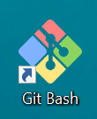

# Инструкция для работы с MD

## Выделение текста

Чтобы выделить текст курсивом необходимо обрамить его зведочками (*) или знаком нижнего подчекивания (_). Например, *вот так* или _вот так_

Чтобы выделить текст жирным необходимо обрамить его двумя зведочками (** ) или двойным знаком нижнего подчекивания (__). Например, **вот так** или __вот так__

Альтернативные способы выделения текста жирным или курсивом нужны для того, чтобы мы могли совмещать оба этих способа. Например, __*вот так*__ или **_вот так_**

## Списки

Чтобы добавить ненумерованный список, необходимо пункты выделять звездочкой (*). Например, вот так:
* элемент 1; 
* элемент 2; 
* элемент 3.

Чтобы добавить нумерованный список, необходимо пункты просто пронумеровать. Например, вот так:
1. Элемент 1. 
2. Элемент 2. 

## Работа с изображением

Базовый синтаксис Markdown для внедрения изображения включает (!), далее без пробела alt text в треугольных скобках и название файла с путем в круглых скобках.

Например:

## Ссылки

Фраза для ссылки должна быть понятной. Иными словами, это должен быть полноценный текст или название страницы, на которую указывает ссылка.

 Важно!

Не используйте "щелкните здесь" в качестве текста ссылки. Она плохо сказывается на оптимизации для поисковых систем и не дает адекватного представления о целевой странице.

Правильно:

For more information, see the [contributor guide index](https://github.com/Azure/azure-content/blob/master/contributor-guide/contributor-guide-index.md).

For more details, see the [SET TRANSACTION ISOLATION LEVEL](/sql/t-sql/statements/set-transaction-isolation-level-transact-sql) reference.

Неправильно:

For more details, see [https://msdn.microsoft.com/library/ms173763.aspx](https://msdn.microsoft.com/library/ms173763.aspx).

For more information, click [here](https://github.com/Azure/azure-content/blob/master/contributor-guide/contributor-guide-index.md).

## Заключение
